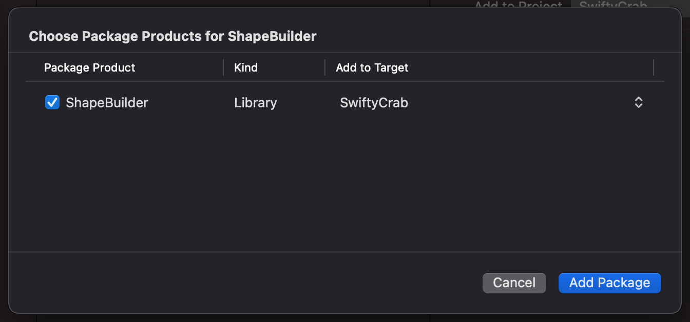

# ShapeBuilder
A result builder implementation that allows to define shape building closures and variables.

## Problem
In SwiftUI, you can end up in a situation in which you would to change a `Shape` property based on a view style. Imagine, you build a view that should either take a circular appearance or have its corners rounded given a certain corner radius. Probably you would end up with something along the lines of:

```swift
struct MyFancyView: View {
  let isRound: Bool

  var body: some View {
    // Fancy content here
      .mask(maskingLayer)
  }

  var maskingLayer: some Shape {
    if isRound {
      return Circle()
    } else {
      return RoundedRectangle(cornerRadius: 10)
    }
  }
}
```

However, this code doesn't compile because maskingLayer declares an opaque return type, but has no return statements in its body from which to infer an underlying type. In other words: Swift expects that maskingLayer is always of the same type.

## Possible solutions
### Type erasure
One way to solve this is to introduce an AnyShape type-erased helper shape and erase the return maskingLayer to AnyShape. This is a similar approach to SwiftUI's built-in AnyView type-erasing View wrapper.

```swift
struct AnyShape: Shape {
  let _path: (CGRect) -> Path

  init<S: Shape>(_ shape: S) {
    _path = shape.path(in:)
  }

  func path(in rect: CGRect) -> Path {
    _path(rect)
  }
}

struct MyFancyView: View {
  let isRound: Bool

  var body: some View {
      // Fancy content here
        .mask(maskingLayer)
  }

  var maskingLayer: some Shape {
    if isRound {
      return AnyShape(Circle())
    } else {
      return AnyShape(RoundedRectangle(cornerRadius: 10))
    }
  }
}
```

As you can see, this requires us to wrap our raw shapes in AnyShape type-erasing wrappers which isn't the most beautiful code you'll ever see, but it works, doesn't it? 🤷‍♂️

## Result builders to the rescue
A second approach of solving this, is to define a result builder similar to SwiftUI's own `@ViewBuilder`. This library implements the `@ShapeBuilder` and `@InsettableShapeBuilder` result builders, allowing you to get rid of type-erasing shape wrappers and even return statements. Mark your computed property or functions with the according result builder name and you're good to go.

```swift
struct MyFancyView: View {
  let isRound: Bool

  var body: some View {
      // Fancy content here
        .mask(maskingLayer)
  }

  @ShapeBuilder var maskingLayer: some Shape {
    if isRound {
      Circle()
    } else {
      RoundedRectangle(cornerRadius: 10)
    }
  }
}
```

### BuiltShape / BuiltInsettableShape
Additionally, this library provides the `BuiltShape` and `BuiltInsettableShape` protocols. Both protocols share similarities with SwiftUI's `View` protocol. They define a get-only `shape` computed property which is marked with a `@ShapeBuilder`/`@InsettableShapeBuilder` annotation.

This allows you to define `BuiltShape`s which themselves are shapes and take the form of the shape property.

```swift
struct MyFancyMask: BuiltShape {
  let isCircle: Bool

  var shape: some Shape {
    if isCircle {
      Circle()
    } else {
      RoundedRectangle(cornerRadius: 10)
    }
  }
}
```

## Installation
### Swift Package
If you want to add **ShapeBuilder** to your Swift packages, add it as a dependency to your `Package.swift`.

```swift
dependencies: [
  .package(
    url: "https://github.com/ohitsdaniel/ShapeBuilder.git",
    from: "0.1.0"
  )
],
targets: [
  .target(
    name: "MyAwesomePackage",
    dependencies: [
      "ShapeBuilder"
    ]
  )
]
```

### Xcode
<p align="center"></img></p>

You can add **ShapeBuilder** to your project via Xcode. Open your project, click on **File → Swift Packages → Add Package Dependency…**, enter the repository url (https://github.com/ohitsdaniel/ShapeBuilder.git) and add the package products to your app target.

## License
This library is released under the MIT license. See [LICENSE](LICENSE) for details.
